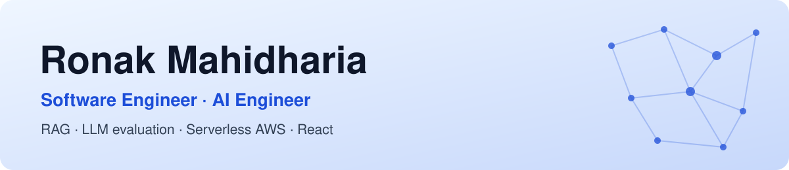

<picture>
  <source media="(prefers-color-scheme: dark)" srcset="assets/banner-dark.svg">
  
</picture>

  

  
  &nbsp;
  

### 👋 About me
- 🏢 **Now:** Software Engineer at [TermScout](https://www.termscout.com), an AI contract-intelligence platform, working across Python, React, and AWS serverless.
- 🤖 **Before:** AI Engineer at EDISCOVERIST, building an AI-powered Microsoft Word add-in for legal document review.
- 🎓 **Education:** M.S. in Information Systems, Northeastern University.
- 💡 **What I care about:** AI whose accuracy is measured rather than assumed, backends that fail loudly and recover cleanly, and interfaces people can use without a manual.

### 🔨 Currently building
New open-source AI projects, each with a published evaluation: a retrieval-augmented generation (RAG) assistant and a tool-using AI agent. I'll pin them here as they ship.

### 🛠️ Tech I work with
<picture>
  <source media="(prefers-color-scheme: dark)" srcset="assets/skills-dark.svg">
  
</picture>

**AI & LLM:** OpenAI API · Azure OpenAI · RAG · Azure AI Search · Prompt engineering · LLM evaluation

<b>📈 Highlights from my work</b> (click to expand)

 

- Saved reviewers 3 to 4 hours per document with an AI-powered Microsoft Word add-in (React, TypeScript, Office.js) that checks provisions, detects the jurisdiction, and scores risk in ESI protocols and protective orders.
- Raised AI accuracy by 30% by grounding LLM output in jurisdiction rules, court templates, and domain-specific clauses through retrieval-augmented generation (RAG) on Azure Cognitive Search, now called Azure AI Search.
- Built a no-login contract analysis funnel in React and Python on AWS Lambda. It runs the core AI pipeline in its own isolated AWS account, returns results that match the main product field for field in about 3 to 4 minutes, and keeps the cost per analysis low.
- Added precision/recall (F1) scoring for multi-select AI answers to our evaluation tooling and validated it in production. It gives the team a much truer read on those answers than the old metric did.
- Cut release and onboarding time by 60% by containerizing the Node.js and Python services with Docker and scripting environment setup.

